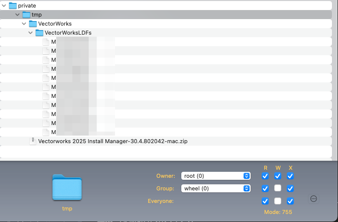
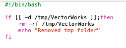
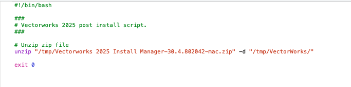

# VectorWorks  
## How to Silently Install Vectorworks on macOS  

---

## Pre-requisites  

You will need to log in to the **VectorWorks Customer Portal** to retrieve files and use **Jamf Composer** to complete the package setup.  

### **Package Creation in Jamf Composer**  
- This package needs to include the **LDFs** and **Vectorworks installer** in **ZIP format**.  
  -   
- A **preinstall script** is recommended to check for and remove the temporary Vectorworks folder.  
  -   
- A **postinstall script** is used to unzip the Vectorworks installer into the **Vectorworks folder**.  
  -   
- Ensure **permissions** are set to `root:wheel`.  

### **Script**  
- The script requires **modifications** before running:  
  - Edit the **Swift Dialog messaging**, including the help button.  
  - Update the `serialAskAndInstall` function to include **all serials** with the corresponding **LDF required**.  

---

## Jamf Implementation  

1. Upload the **updated script** and **built package** into Jamf.  
   - Set the script to **run after** the package installation.  
2. Create a **policy** to install the package and execute the script.  
3. Configure **Self Service** as required.  
4. **Test** before deployment.  

---

## Logging Location  

The script generates **two log files**, which can be viewed in the **Console app**.  
Log file locations:  
- `/private/var/log/VectorWorks-Commands.log`  
- `/private/var/log/VectorWorks-Installation.log`  

---

## Disclaimer  

⚠️ **I'm not a scripting expert, so review and use this at your own risk.**  
Always ensure **thorough testing** before moving to **production**.  